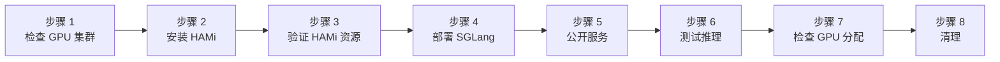
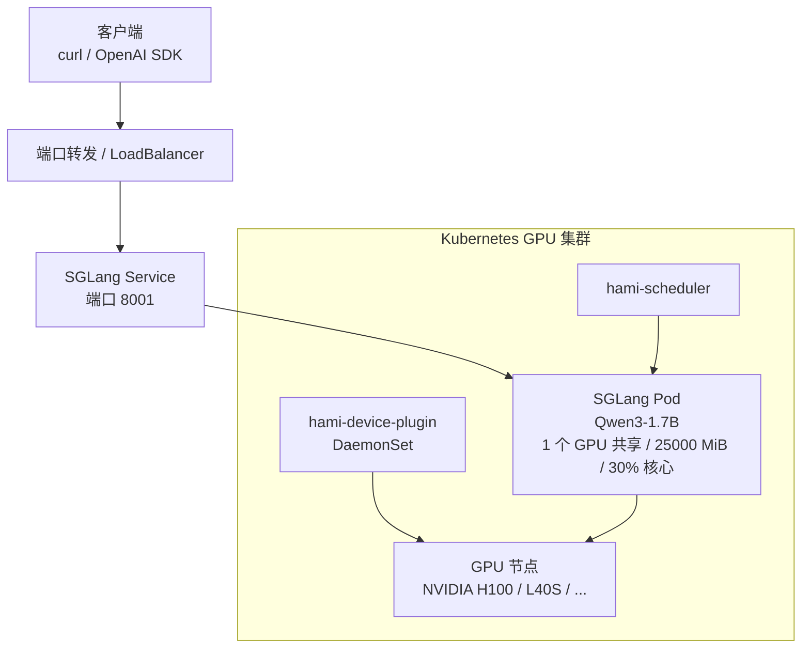

本实验演示如何在已有 NVIDIA GPU 的 Kubernetes 集群上安装 HAMi，并使用 HAMi 调度 [SGLang](https://github.com/sgl-project/sglang) 推理服务。完成后，你将获得兼容 OpenAI API 的模型服务，并可验证 HAMi 在 Pod 内实施的软件显存配额和算力节流。

本指南参考[实验 6：在 HAMi GPU 共享资源上运行 vLLM](./hami-vllm)，不依赖特定云厂商。

## 学习目标

- 检查 GPU Kubernetes 集群是否满足 HAMi 和 SGLang 的前置条件
- 安装 HAMi 调度器和设备插件
- 使用 `nvidia.com/gpu`、`nvidia.com/gpumem` 和 `nvidia.com/gpucores` 运行 SGLang
- 通过端口转发测试兼容 OpenAI 的 API
- 验证容器内可见配额以及超额 CUDA 分配被拒绝

## 实验概览



## 部署架构



## 前置条件

- 正常运行的 Kubernetes 集群
- 至少一个可用显存超过 25,000 MiB 的 NVIDIA GPU 节点（本指南使用 H100 80GB）。使用 A10 时，需将所有 `nvidia.com/gpumem` 请求和限制降低到 `nvidia-smi` 显示的容量以下
- 已连接集群的 `kubectl` 和 Helm 3.x
- GPU 节点已安装 NVIDIA 驱动、Container Toolkit 和容器运行时支持
- 集群能够拉取 `lmsysorg/sglang` 镜像并下载 Hugging Face 模型权重

> **kind 提示：** 使用 GPU 直通时，需在 kind 节点内配置 `nvidia-container-toolkit`，并在安装 HAMi 前将 containerd 的 `default_runtime_name` 设为 `nvidia`。

## 示例集群状态

本指南在由一张 NVIDIA H100 80GB 支持的 kind 控制平面节点上完成验证。

```bash
kubectl get nodes -o wide
```

```plaintext
NAME                      STATUS   ROLES           AGE   VERSION   INTERNAL-IP   OS-IMAGE                       CONTAINER-RUNTIME
hami-demo-control-plane   Ready    control-plane   2m    v1.36.1   172.19.0.2    Debian GNU/Linux 13 (trixie)   containerd://2.3.1
```

主机 GPU：

```bash
nvidia-smi --query-gpu=index,name,memory.total --format=csv
```

```plaintext
index, name, memory.total [MiB]
0, NVIDIA H100 80GB HBM3, 81559 MiB
```

安装 HAMi 后，每张物理 GPU 被注册为 10 个可调度共享资源：

```bash
kubectl get nodes -o 'custom-columns=NAME:.metadata.name,GPU:.status.allocatable.nvidia\.com/gpu'
kubectl get pods -n kube-system -l app.kubernetes.io/instance=hami -o wide
```

```plaintext
NAME                      GPU
hami-demo-control-plane   10
```

```plaintext
NAME                              READY   STATUS    NODE
hami-device-plugin-...            2/2     Running   hami-demo-control-plane
hami-scheduler-...                2/2     Running   hami-demo-control-plane
```

## 步骤 1：检查 GPU 集群

```bash
kubectl get nodes -o wide
kubectl describe node | grep -A8 -E "Capacity:|Allocatable:" | grep -E "nvidia.com/gpu|cpu:|memory:"
```

HAMi 和厂商 NVIDIA 设备插件会注册相同的 `nvidia.com/gpu` 资源，因此二者不能同时运行在同一 GPU 节点。保留 NVIDIA 驱动、Container Toolkit 和运行时，但在安装 HAMi 前禁用或移除厂商设备插件。

先确认现有插件的安装方式。稍后需要使用原始 Helm release、Operator 配置、托管插件设置或源清单来恢复它：

```bash
kubectl get daemonsets --all-namespaces | grep -E 'nvidia.*device-plugin'

VENDOR_PLUGIN_NAMESPACE=<namespace>
VENDOR_PLUGIN_DAEMONSET=<daemonset-name>
kubectl delete daemonset "${VENDOR_PLUGIN_DAEMONSET}" \
  -n "${VENDOR_PLUGIN_NAMESPACE}"
```

> 如果 DaemonSet 由 GPU Operator 或托管 Kubernetes 插件管理，请通过相应的 Operator/插件配置禁用它，否则控制器会重新创建 DaemonSet。不要卸载主机驱动或 NVIDIA 容器运行时。

记录 `gpu=on` 标签是否已存在，然后标记 GPU 节点：

```bash
GPU_NODE=<gpu-node-name>
GPU_LABEL_WAS_PRESENT="$(kubectl get node "${GPU_NODE}" -o go-template='{{if .metadata.labels}}{{if index .metadata.labels "gpu"}}true{{else}}false{{end}}{{else}}false{{end}}')" || {
  echo "无法记录 gpu 标签是否存在" >&2
  exit 1
}
GPU_LABEL_BEFORE="$(kubectl get node "${GPU_NODE}" -o jsonpath='{.metadata.labels.gpu}')" || {
  echo "无法记录当前的 gpu 标签" >&2
  exit 1
}
kubectl label node "${GPU_NODE}" gpu=on --overwrite
```

## 步骤 2：安装 HAMi

```bash
helm repo add hami-charts https://project-hami.github.io/HAMi
helm repo update hami-charts
```

保存为 `hami-values.yaml`：

```yaml
global:
  managedNodeSelectorEnable: true
  managedNodeSelector:
    gpu: "on"

devicePlugin:
  # 这是 chart 的默认值。此处显式展示，因为实验会验证 10 个共享资源。
  deviceSplitCount: 10

scheduler:
  leaderElect: false
```

| 配置 | 说明 |
| --- | --- |
| `global.managedNodeSelector.gpu: "on"` | 仅在带 `gpu=on` 标签的节点上运行 HAMi 设备插件。 |
| `devicePlugin.deviceSplitCount: 10` | 将每张物理 GPU 注册为 10 个 vGPU。该值与当前 chart 默认值一致，并因实验会验证结果而显式设置。 |
| `scheduler.leaderElect: false` | 本实验使用单副本调度器。 |

```bash
helm upgrade --install hami hami-charts/hami \
  -n kube-system \
  -f hami-values.yaml \
  --version 2.9.0
```

> 在部分 ACK Kubernetes 1.36 集群中，如果调度器日志显示 `resource.k8s.io` 权限错误，请应用实验 6 使用的 DRA RBAC 辅助清单：
>
> ```bash
> RBAC_COMMIT="90ac82510bfabe05894dd8037078c59f02a51553"
> RBAC_SHA256="e0a77f99422230ccc8958aac0d04694347769279ec26a9d4a5ff729f89efe3d9"
> RBAC_MANIFEST="hami-scheduler-dra-rbac.yaml"
> curl -fsSLo "${RBAC_MANIFEST}" \
>   "https://raw.githubusercontent.com/Project-HAMi/website/${RBAC_COMMIT}/tutorials/labs/hami-vllm/hami-scheduler-dra-rbac.yaml"
> printf '%s  %s\n' "${RBAC_SHA256}" "${RBAC_MANIFEST}" | sha256sum -c -
> kubectl apply -f "${RBAC_MANIFEST}"
> ```

```bash
kubectl rollout status deployment/hami-scheduler -n kube-system
kubectl rollout status daemonset/hami-device-plugin -n kube-system
```

## 步骤 3：验证 HAMi 资源

```bash
kubectl get pods -n kube-system -l app.kubernetes.io/instance=hami -o wide
kubectl get nodes -o 'custom-columns=NAME:.metadata.name,GPU:.status.allocatable.nvidia\.com/gpu'
```

预期 HAMi 调度器和设备插件为 `Running`，GPU 节点显示 `nvidia.com/gpu=10`。

## 步骤 4：使用 HAMi 资源部署 SGLang

本实验部署 Qwen3-1.7B，请求一个 HAMi GPU 共享、25,000 MiB 显存和 30% GPU 核心。

```bash
kubectl apply -f - <<'EOF'
apiVersion: v1
kind: Namespace
metadata:
  name: sglang
---
apiVersion: apps/v1
kind: Deployment
metadata:
  name: sglang-qwen3-17b
  namespace: sglang
spec:
  replicas: 1
  selector:
    matchLabels:
      app.kubernetes.io/name: sglang-qwen3-17b
  template:
    metadata:
      labels:
        app.kubernetes.io/name: sglang-qwen3-17b
      annotations:
        hami.io/node-scheduler-policy: binpack
        hami.io/gpu-scheduler-policy: binpack
    spec:
      schedulerName: hami-scheduler
      containers:
        - name: sglang
          image: lmsysorg/sglang:v0.5.7
          imagePullPolicy: IfNotPresent
          command:
            - python3
            - -m
            - sglang.launch_server
            - --model-path=Qwen/Qwen3-1.7B
            - --host=0.0.0.0
            - --port=30000
            - --mem-fraction-static=0.7
            - --context-length=8192
            - --attention-backend=triton
          ports:
            - name: http
              containerPort: 30000
          resources:
            requests:
              cpu: "2"
              memory: 8Gi
              nvidia.com/gpu: "1"
              nvidia.com/gpumem: "25000"
              nvidia.com/gpucores: "30"
            limits:
              cpu: "8"
              memory: 32Gi
              nvidia.com/gpu: "1"
              nvidia.com/gpumem: "25000"
              nvidia.com/gpucores: "30"
          readinessProbe:
            httpGet:
              path: /health
              port: 30000
            initialDelaySeconds: 30
            periodSeconds: 10
            timeoutSeconds: 5
            failureThreshold: 90
          volumeMounts:
            - name: dshm
              mountPath: /dev/shm
      volumes:
        - name: dshm
          emptyDir:
            medium: Memory
            sizeLimit: 8Gi
---
apiVersion: v1
kind: Service
metadata:
  name: sglang-qwen3-17b
  namespace: sglang
spec:
  type: ClusterIP
  selector:
    app.kubernetes.io/name: sglang-qwen3-17b
  ports:
    - name: http
      port: 8001
      targetPort: http
EOF
```

| 配置 | 说明 |
| --- | --- |
| `schedulerName: hami-scheduler` | 将调度明确交给 HAMi。 |
| `nvidia.com/gpumem: "25000"` | 以 MiB 为单位的软件 CUDA 显存配额，也通过被拦截的 NVML 调用显示。 |
| `nvidia.com/gpucores: "30"` | 应用目标为 30% SM 使用率的软件算力节流。 |
| `--attention-backend=triton` | 使用在 H100 验证集群上测试的 Triton 后端；其他 GPU 应选择其 SGLang 版本和架构支持的后端。 |
| `/dev/shm` | 为 SGLang 提供更大的共享内存。 |

```bash
kubectl rollout status deployment/sglang-qwen3-17b -n sglang --timeout=30m
kubectl describe pod -n sglang -l app.kubernetes.io/name=sglang-qwen3-17b \
  | grep -E "hami-scheduler|Filtering|Binding" -A2
```

## 步骤 5：公开 SGLang 服务

```bash
kubectl -n sglang port-forward svc/sglang-qwen3-17b 8001:8001
```

在另一个终端中执行后续测试。

## 步骤 6：测试推理

```bash
curl -s http://127.0.0.1:8001/v1/models | python3 -m json.tool

curl -s http://127.0.0.1:8001/v1/chat/completions \
  -H 'Content-Type: application/json' \
  -d '{
    "model": "Qwen/Qwen3-1.7B",
    "messages": [{"role": "user", "content": "Explain GPU sharing in one sentence."}],
    "temperature": 0.2,
    "max_tokens": 80,
    "chat_template_kwargs": {"enable_thinking": false}
  }' | python3 -m json.tool
```

若响应包含 `choices[0].message.content`，说明 SGLang 推理服务正常工作。

## 步骤 7：检查 GPU 分配

```bash
POD=$(kubectl get pod -n sglang -l app.kubernetes.io/name=sglang-qwen3-17b -o jsonpath='{.items[0].metadata.name}')
kubectl get pod -n sglang ${POD} \
  -o jsonpath='{.spec.schedulerName}{"\n"}{.spec.containers[0].resources.limits}{"\n"}'
kubectl exec -n sglang ${POD} -- env | grep -E 'CUDA_DEVICE|NVIDIA_VISIBLE'
kubectl exec -n sglang ${POD} -- nvidia-smi
```

HAMi 注入的环境变量示例：

```plaintext
NVIDIA_VISIBLE_DEVICES=GPU-04b76a6c-da10-342f-e9f5-5f5684eacb86
CUDA_DEVICE_MEMORY_LIMIT_0=25000m
CUDA_DEVICE_SM_LIMIT=30
```

Pod 内的预期显存视图：

```plaintext
| GPU  Name                 ... | Memory-Usage          |
| NVIDIA H100 80GB HBM3     ... | 18213MiB / 25000MiB   |
```

主机仍显示完整物理容量：

```bash
nvidia-smi --query-gpu=memory.total,memory.used --format=csv
```

```plaintext
memory.total [MiB], memory.used [MiB]
81559 MiB, 18560 MiB
```

容器内 `nvidia-smi` 应显示接近 25,000 MiB 的总显存，而主机仍显示物理卡完整容量。这证明 HAMi 的 NVML 拦截公开了所配置的配额，但还不能单独证明超额 CUDA 分配会失败。

可以选择从单独进程验证 CUDA 层的配额实施。将 `GPU_QUOTA_MIB` 设置为清单中的 `nvidia.com/gpumem` 值。探针会请求比该配额多 1024 MiB，因此降低其他 GPU 的配额后仍然适用：

```bash
GPU_QUOTA_MIB=25000
OVER_QUOTA_MIB=$((GPU_QUOTA_MIB + 1024))
kubectl exec -i -n sglang ${POD} -- \
  env OVER_QUOTA_MIB="${OVER_QUOTA_MIB}" python3 - <<'PY'
import os
import torch

allocation_mib = int(os.environ["OVER_QUOTA_MIB"])
try:
    torch.empty(allocation_mib * 1024**2 // 4, dtype=torch.float32, device="cuda")
except RuntimeError as exc:
    if "out of memory" not in str(exc).lower():
        raise
    print("PASS: over-quota CUDA allocation returned out of memory")
else:
    raise SystemExit("FAIL: over-quota CUDA allocation unexpectedly succeeded")
PY
```

预期输出包含 `PASS`。失败的请求不应保留显存或改变服务进程。随后确认实时服务仍然健康：

```bash
curl --fail --silent http://127.0.0.1:8001/health
curl --fail --silent http://127.0.0.1:8001/v1/models | python3 -m json.tool
```

HAMi 通过拦截 CUDA 分配调用实施软件显存配额，这不同于 MIG 等硬件分区；算力限制同样属于软件节流。

## 故障排除

| 现象                           | 检查项                                                       |
| ------------------------------ | ------------------------------------------------------------ |
| `hami-device-plugin` CrashLoop | NVIDIA Container Toolkit 必须向 Pod 注入驱动库。             |
| `hami-device-plugin` 未就绪    | 节点缺少 `gpu=on` 标签，或节点选择器不匹配。                 |
| SGLang Pod Pending             | 检查 HAMi 调度事件，并确认 `gpumem` 不超过物理 GPU 显存。    |
| 镜像拉取失败或磁盘已满         | SGLang 镜像较大；清理未使用镜像或预先加载固定版本镜像。      |
| Pod 内仍显示完整显存           | 重新检查 `schedulerName`、资源限制和 HAMi webhook/调度事件。 |

```bash
kubectl get pods -A -o wide
kubectl describe pod -n sglang -l app.kubernetes.io/name=sglang-qwen3-17b
kubectl logs -n sglang -l app.kubernetes.io/name=sglang-qwen3-17b --tail=100
kubectl logs -n kube-system deploy/hami-scheduler --tail=100
```

## 清理

```bash
kubectl delete namespace sglang --ignore-not-found
helm uninstall hami -n kube-system
```

卸载 HAMi 后，使用之前禁用插件时对应的方法恢复厂商设备插件。对于通过清单安装的自管理插件，请应用原始的固定版本源清单，不要使用实时 `kubectl get -o yaml` 导出：

```bash
kubectl apply -f <original-version-pinned-device-plugin-manifest>
```

对于 Helm release、GPU Operator 或托管插件，请通过相同的管理机制恢复它，并确认只有一个设备插件 DaemonSet 管理 `nvidia.com/gpu`。

恢复原始 `gpu` 标签状态。请在记录 `GPU_LABEL_WAS_PRESENT` 和 `GPU_LABEL_BEFORE` 的同一 shell 中执行：

```bash
if [ "${GPU_LABEL_WAS_PRESENT}" = true ]; then
  kubectl label node "${GPU_NODE}" "gpu=${GPU_LABEL_BEFORE}" --overwrite
else
  kubectl label node "${GPU_NODE}" gpu-
fi
```

## 验证结果

| 声明                      | 证据                                                     |
| ------------------------- | -------------------------------------------------------- |
| HAMi 接管 GPU 调度        | Pod 使用 `hami-scheduler` 并请求 HAMi GPU 资源。         |
| SGLang 在 HAMi 资源上运行 | Pod Ready，HAMi 注入显存和 SM 限制变量。                 |
| 容器内可见显存配额        | Pod 内显示 25,000 MiB，而主机显示完整物理容量。          |
| 超额分配被拒绝            | PyTorch CUDA 分配请求比配置配额高 1024 MiB，并返回 OOM。 |
| 推理服务可访问            | 模型列表和聊天接口均正常返回。                           |

## 后续步骤

- 增加副本数量，观察 HAMi 如何使用 `binpack` 放置多个 SGLang Pod。
- 降低 `gpumem` 和 `gpucores`，并在同一 GPU 上共置另一个小型工作负载。
- 参考配套的 [KitOps ModelKit 实验 PR](https://github.com/Project-HAMi/website/pull/655)，从 OCI 注册表交付模型。
- 有关显存隔离和小切片共享模式，请参阅[实验 3：GPU 切分](./gpu-partitioning)。
